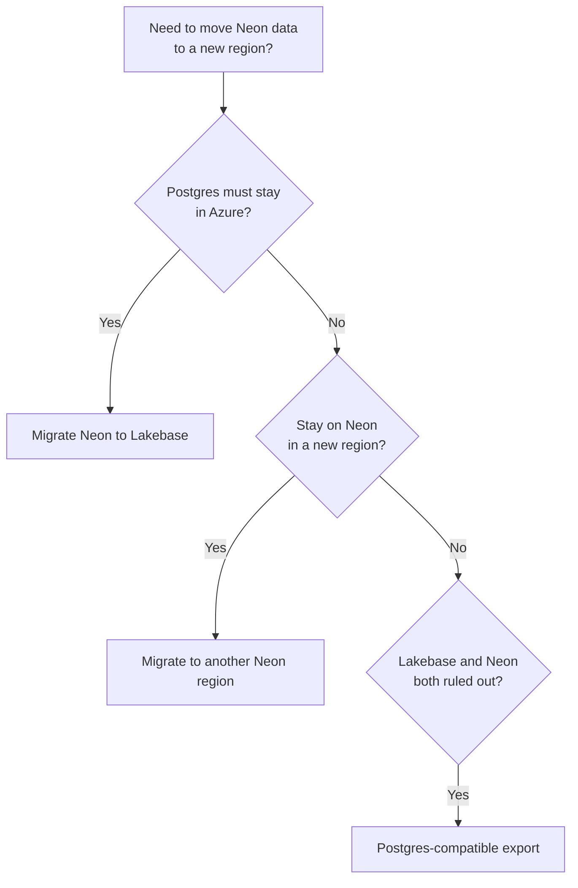

> This page location: Migrate to Neon > Region migration > Overview
> Full Neon documentation index: https://neon.com/docs/llms.txt

> Summary: Choose a path to migrate your database to another region (new Neon project plus data migration), or to export your Neon data in Postgres-compatible form. Covers another Neon region, Lakebase, dump and restore, logical replication, and export options.

# Region migration

Move your Neon database to another region

A Neon **project** is created in a single [region](https://neon.com/docs/introduction/regions). Your database runs there, and you **cannot change the region** for that project.

If you need your **data** in a different region, you **create a new Neon project** in that region and **migrate your database** into it.

Common reasons to migrate to a different region:

- Your app moved to a different region and you want lower latency between your app and database.
- You need to set up a new environment in another region.
- You are migrating away from a [deprecated Neon Azure](https://neon.com/docs/introduction/regions#azure-regions) region.

**Note: Databricks Lakebase**

If you must keep Postgres in Azure for residency or colocation, Databricks Lakebase Postgres supports Azure regions. See **[Migrate Neon to Lakebase](https://neon.com/docs/guides/migrate-neon-to-lakebase)**.

## Choose a path

Use the flowchart to pick a migration path that fits your requirements.

## Select a migration guide

Select the guide that matches your requirements.

1. **[Migrate to another Neon region](https://neon.com/docs/import/migrate-neon-to-another-region)**. Compare the **Import Data Assistant**, dump and restore, and logical replication, then follow the guide linked from that page.
2. **[Migrate Neon to Lakebase](https://neon.com/docs/guides/migrate-neon-to-lakebase)**. Create a Lakebase project, **`pg_dump`** from Neon, **`pg_restore`** on Lakebase.
3. **[Postgres-compatible export from Neon](https://neon.com/docs/guides/export-neon-postgres-compatible)**. If another Neon region and Lakebase do not meet your requirements, use `pg_dump` to export your data in a Postgres-compatible format for migration elsewhere.

---

## Related docs (Region migration)

- [Azure regions deprecation](https://neon.com/docs/import/azure-regions-deprecation)
- [Neon to another region](https://neon.com/docs/import/migrate-neon-to-another-region)
- [Neon to Lakebase](https://neon.com/docs/guides/migrate-neon-to-lakebase)
- [Postgres-compatible export](https://neon.com/docs/guides/export-neon-postgres-compatible)
